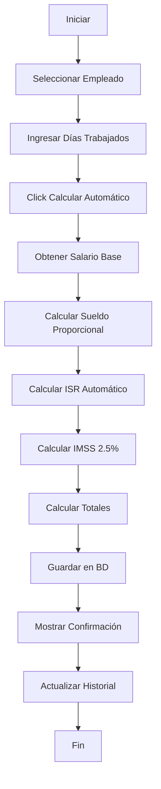
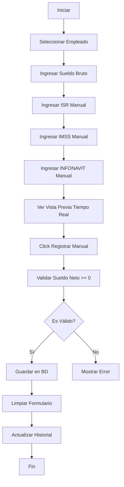

# 💼 Sistema de Nóminas Profesional - Documentación Completa

## 📋 Tabla de Contenidos
1. [Descripción General](#descripción-general)
2. [Características Principales](#características-principales)
3. [Modo Automático](#modo-automático)
4. [Modo Manual](#modo-manual)
5. [Cálculo de ISR](#cálculo-de-isr)
6. [Interfaz Ultra Moderna](#interfaz-ultra-moderna)
7. [Flujo de Trabajo](#flujo-de-trabajo)
8. [Validaciones Implementadas](#validaciones-implementadas)
9. [Ejemplos de Uso](#ejemplos-de-uso)

---

## 🎯 Descripción General

El **Sistema de Nóminas Profesional** es un módulo integral diseñado para el cálculo y registro de nóminas con cumplimiento total de la legislación fiscal mexicana. Ofrece dos modos de operación para adaptarse a diferentes necesidades empresariales.

### Normativa Aplicable
- **ISR**: Artículo 96 de la Ley del Impuesto Sobre la Renta (Tabla Quincenal 2024)
- **IMSS**: Ley del Seguro Social (Cuota Obrera aproximada 2.5%)
- **INFONAVIT**: Ley del INFONAVIT (Variable según crédito activo)

---

## ✨ Características Principales

### 🚀 Dual Mode System
1. **Modo Automático** 🤖
   - Cálculo automático de ISR según tabla oficial
   - Cálculo automático de IMSS (2.5%)
   - Cálculo proporcional por días trabajados
   - Ideal para nóminas regulares

2. **Modo Manual** ✍️
   - Ingreso manual de todas las deducciones
   - Vista previa en tiempo real
   - Útil para casos especiales, ajustes y correcciones
   - Control total sobre cada concepto

### 📊 Panel de Estadísticas
- **Tarjetas informativas** con cada concepto fiscal
- **Indicadores visuales** del cumplimiento normativo
- **Diseño moderno** con animaciones suaves

### 📈 Historial Completo
- GridView con todas las nóminas procesadas
- Formato de moneda México (MXN)
- Ordenamiento cronológico descendente
- Botón de actualización manual

---

## 🤖 Modo Automático

### Función Principal: `btnCalcularAuto_Click`

#### Proceso de Cálculo
1. **Validación del Empleado**
   - Verifica que se haya seleccionado un empleado válido
   - Obtiene el `EmpleadoID` del dropdown

2. **Obtención del Salario Base**
   ```sql
   SELECT SalarioBase FROM Empleados WHERE EmpleadoID = @ID
   ```

3. **Cálculo Proporcional**
   ```csharp
   decimal sueldoBruto = (salarioBase / 15) * diasTrabajados;
   ```
   - Asume periodo quincenal (15 días)
   - Ajusta proporcionalmente según días trabajados

4. **Cálculo Automático de Deducciones**
   - **ISR**: Función `CalcularISR()` con tabla oficial
   - **IMSS**: `sueldoBruto * 0.025m` (2.5%)
   - **INFONAVIT**: `0.00m` (configurable según lógica empresarial)
   - **Otras**: `0.00m` (reservado para expansión)

5. **Registro en Base de Datos**
   - Inserta en tabla `Nominas` con todos los campos
   - Actualiza el historial automáticamente
   - Muestra mensaje de confirmación con sueldo neto

### Campos del Formulario
| Campo | Tipo | Descripción |
|-------|------|-------------|
| `ddlEmpleados` | DropDownList | Listado de empleados activos |
| `txtDiasTrabajados` | TextBox (Number) | Días trabajados en el periodo (1-31) |
| `btnCalcularAuto` | Button | Ejecuta el cálculo automático |

### Validaciones
- **RequiredFieldValidator**: Días trabajados obligatorio
- **RangeValidator**: Días entre 1 y 31
- **ValidationGroup**: "Auto" (no interfiere con modo manual)

---

## ✍️ Modo Manual

### Función Principal: `btnCalcularManual_Click`

#### Proceso de Registro
1. **Validación del Empleado**
   - Verifica selección válida en `ddlEmpleadosManual`

2. **Captura de Valores Manuales**
   ```csharp
   decimal sueldoBruto = Convert.ToDecimal(txtSueldoBrutoManual.Text);
   decimal isr = Convert.ToDecimal(txtISRManual.Text);
   decimal imss = Convert.ToDecimal(txtIMSSManual.Text);
   decimal infonavit = Convert.ToDecimal(txtInfonavitManual.Text);
   decimal otras = Convert.ToDecimal(txtOtrasManual.Text);
   ```

3. **Cálculo de Totales**
   ```csharp
   decimal totalDeducciones = isr + imss + infonavit + otras;
   decimal totalNeto = sueldoBruto - totalDeducciones;
   ```

4. **Validación de Sueldo Neto**
   - Verifica que `totalNeto >= 0`
   - Alerta al usuario si las deducciones exceden el sueldo bruto

5. **Registro y Limpieza**
   - Guarda en base de datos
   - Limpia el formulario automáticamente
   - Actualiza el historial

### Vista Previa en Tiempo Real
JavaScript integrado que calcula automáticamente mientras el usuario escribe:

```javascript
function calcularEnCliente() {
	var bruto = parseFloat(txtSueldoBrutoManual.value) || 0;
	var isr = parseFloat(txtISRManual.value) || 0;
	var imss = parseFloat(txtIMSSManual.value) || 0;
	var infonavit = parseFloat(txtInfonavitManual.value) || 0;
	var otras = parseFloat(txtOtrasManual.value) || 0;

	var totalDeducciones = isr + imss + infonavit + otras;
	var neto = bruto - totalDeducciones;

	// Actualiza los elementos de vista previa
}
```

### Campos del Formulario Manual
| Campo | Tipo | Descripción | Validación |
|-------|------|-------------|------------|
| `ddlEmpleadosManual` | DropDownList | Empleados activos | N/A |
| `txtDiasManual` | TextBox (Number) | Días trabajados | Required |
| `txtSueldoBrutoManual` | TextBox (Number) | Sueldo bruto total | Required |
| `txtISRManual` | TextBox (Number) | ISR manual | Opcional (default 0) |
| `txtIMSSManual` | TextBox (Number) | IMSS manual | Opcional (default 0) |
| `txtInfonavitManual` | TextBox (Number) | INFONAVIT manual | Opcional (default 0) |
| `txtOtrasManual` | TextBox (Number) | Otras deducciones | Opcional (default 0) |

---

## 📊 Cálculo de ISR

### Función: `CalcularISR(decimal ingreso)`

Implementa la tabla oficial del **Artículo 96 de la Ley del ISR** para periodos quincenales (2024).

#### Tabla de Tramos (Simplificada)
| Rango Inferior | Rango Superior | Cuota Fija | Tasa sobre Excedente |
|----------------|----------------|------------|---------------------|
| $0.00 | $1,768.96 | $0.00 | 0.00% |
| $1,768.97 | $2,653.38 | $0.00 | 1.92% |
| $2,653.39 | $4,472.84 | $16.98 | 6.40% |
| $4,472.85 | $5,490.24 | $133.48 | 10.88% |
| $5,490.25 | $6,538.44 | $244.21 | 16.00% |
| $6,538.45 | $9,614.67 | $411.93 | 17.92% |
| $9,614.68 | $19,229.33 | $963.64 | 21.36% |
| $19,229.34 | $28,843.99 | $3,016.87 | 23.52% |
| $28,844.00 | $48,073.32 | $5,278.45 | 30.00% |
| $48,073.33 | $96,146.63 | $11,047.26 | 32.00% |
| $96,146.64 | En adelante | $26,430.67 | 35.00% |

#### Fórmula de Cálculo
```csharp
ISR = CuotaFija + ((Ingreso - LimiteInferior) * TasaExcedente)
```

#### Ejemplo Práctico
**Sueldo Quincenal**: $8,000.00

1. Ubicar tramo: $6,538.45 - $9,614.67
2. Cuota fija: $411.93
3. Excedente: $8,000.00 - $6,538.44 = $1,461.56
4. ISR sobre excedente: $1,461.56 × 17.92% = $261.95
5. **ISR Total**: $411.93 + $261.95 = **$673.88**

---

## 🎨 Interfaz Ultra Moderna

### Diseño Visual

#### 1. **Hero Banner Gradiente**
```css
background: linear-gradient(135deg, #667eea 0%, #764ba2 100%);
```
- Título principal con emoji 💼
- Subtítulo descriptivo profesional
- Sombra elevada con efecto glassmorphism

#### 2. **Tarjetas de Estadísticas**
- Grid responsive (4 columnas)
- Animación hover con `translateY(-5px)`
- Iconos grandes y colores institucionales
- Borde izquierdo de color primario

#### 3. **Sistema de Pestañas (Tabs)**
- Diseño horizontal con indicador inferior
- Transición suave entre modos
- Animación `fadeIn` al cambiar de contenido
- Color activo con línea inferior animada

#### 4. **Alertas Informativas**
- Gradientes diferenciados por modo:
  - **Automático**: Azul (`#4facfe → #00f2fe`)
  - **Manual**: Rosa (`#f093fb → #f5576c`)
- Iconos grandes flotantes
- Texto claro y conciso

#### 5. **Panel de Cálculo**
- Fondo gris claro (`#f8f9fa`)
- Campos organizados en grid responsive
- Vista previa con borde destacado
- Fuentes grandes para valores principales

#### 6. **Tabla de Historial**
- Header con botón de actualización
- Columnas con alineación inteligente:
  - Números a la derecha
  - Texto centrado o izquierda
- Colores semánticos:
  - Verde para sueldo neto
  - Rojo para deducciones
- Formato de moneda automático

### Colores del Sistema
```css
--primary-color: #667eea
--secondary-color: #764ba2
--success-color: #28a745
--danger-color: #dc3545
--text-primary: #2d3748
--text-secondary: #718096
```

---

## 🔄 Flujo de Trabajo

### Modo Automático


### Modo Manual


---

## ✅ Validaciones Implementadas

### Lado del Cliente (ASP.NET Validators)
| Validador | Control | Regla | Mensaje |
|-----------|---------|-------|---------|
| RequiredFieldValidator | txtDiasTrabajados | Obligatorio | "Ingrese los días trabajados" |
| RangeValidator | txtDiasTrabajados | 1-31 | "Los días deben estar entre 1 y 31" |
| RequiredFieldValidator | txtDiasManual | Obligatorio | "Requerido" |
| RequiredFieldValidator | txtSueldoBrutoManual | Obligatorio | "Requerido" |

### Lado del Servidor (C#)
1. **Validación de Empleado Seleccionado**
   ```csharp
   if (empleadoId == 0) {
	   ClientScript.RegisterStartupScript(...);
	   return;
   }
   ```

2. **Validación de Sueldo Neto Positivo**
   ```csharp
   if (totalNeto < 0) {
	   ClientScript.RegisterStartupScript(...);
	   return;
   }
   ```

3. **Manejo de Excepciones**
   - `FormatException`: Valores numéricos inválidos
   - `Exception`: Errores generales con mensaje descriptivo

---

## 📖 Ejemplos de Uso

### Ejemplo 1: Nómina Quincenal Completa (Modo Automático)

**Datos del Empleado**:
- Nombre: Juan Pérez López
- Salario Mensual: $15,000.00
- Días trabajados: 15 (quincena completa)

**Proceso**:
1. Seleccionar "Juan Pérez López" en el dropdown
2. Verificar que días = 15
3. Click en "🧮 Calcular y Registrar Nómina Automática"

**Resultado**:
- Sueldo Bruto: $7,500.00
- ISR Retenido: $863.75 (calculado automáticamente)
- IMSS Obrero: $187.50 (2.5%)
- INFONAVIT: $0.00
- **Total Deducciones**: $1,051.25
- **Sueldo Neto**: **$6,448.75**

---

### Ejemplo 2: Nómina con Días Proporcionales (Modo Automático)

**Datos del Empleado**:
- Nombre: María González Sánchez
- Salario Mensual: $12,000.00
- Días trabajados: 10 (faltó 5 días)

**Proceso**:
1. Seleccionar "María González Sánchez"
2. Cambiar días a **10**
3. Click en "🧮 Calcular"

**Resultado**:
- Sueldo Bruto: $4,000.00 (proporcional a 10 días)
- ISR Retenido: $109.74
- IMSS Obrero: $100.00
- **Sueldo Neto**: **$3,790.26**

---

### Ejemplo 3: Ajuste Manual con Préstamo (Modo Manual)

**Escenario**: Empleado con préstamo de nómina que requiere descuento adicional

**Datos**:
- Empleado: Carlos Ramírez Torres
- Sueldo bruto: $8,000.00
- ISR (calculado previamente): $673.88
- IMSS: $200.00
- INFONAVIT: $0.00
- **Préstamo interno**: $500.00

**Proceso**:
1. Cambiar a pestaña "✍️ Cálculo Manual"
2. Seleccionar "Carlos Ramírez Torres"
3. Ingresar valores:
   - Días: 15
   - Sueldo Bruto: **8000**
   - ISR: **673.88**
   - IMSS: **200**
   - INFONAVIT: **0**
   - Otras: **500** (préstamo)
4. Verificar vista previa en tiempo real
5. Click en "💾 Registrar Nómina Manual"

**Resultado**:
- Total Deducciones: $1,373.88
- **Sueldo Neto**: **$6,626.12**

---

### Ejemplo 4: Corrección de Nómina (Modo Manual)

**Escenario**: Se procesó una nómina con error y se necesita ajustar manualmente

**Situación**:
- Empleado: Ana Martínez Flores
- Se calculó ISR incorrecto por bonos extraordinarios
- Se requiere ISR real de $1,200.00 (en lugar del automático)

**Proceso**:
1. Modo Manual
2. Ingresar todos los valores correctos
3. ISR manual: **1200.00**
4. Registrar

**Ventaja**: Control total sin afectar el cálculo automático de otros empleados

---

## 🔧 Configuración y Personalización

### Ajustar Porcentaje de IMSS
**Archivo**: `Nominas.aspx.cs`  
**Línea**: ~95

```csharp
decimal imssObrero = sueldoBruto * 0.025m;  // Cambiar 0.025 según necesidad
```

### Habilitar INFONAVIT Automático
**Archivo**: `Nominas.aspx.cs`  
**Línea**: ~96

```csharp
// Opción 1: Fijo al 5%
decimal infonavit = sueldoBruto * 0.05m;

// Opción 2: Consultar desde tabla Empleados
// SELECT TieneCredito FROM Empleados WHERE EmpleadoID = @ID
// decimal infonavit = tieneCredito ? sueldoBruto * 0.05m : 0.00m;
```

### Modificar Periodo Base
Actualmente asume quincena (15 días). Para cambiar:

```csharp
// Quincenal (actual)
decimal sueldoBruto = (salarioBase / 15) * diasTrabajados;

// Semanal
decimal sueldoBruto = (salarioBase / 7) * diasTrabajados;

// Mensual
decimal sueldoBruto = (salarioBase / 30) * diasTrabajados;
```

---

## 🗄️ Estructura de Base de Datos

### Tabla: `Nominas`
```sql
CREATE TABLE Nominas (
	NominaID INT PRIMARY KEY IDENTITY(1,1),
	EmpleadoID INT FOREIGN KEY REFERENCES Empleados(EmpleadoID),
	FechaPeriodo DATE DEFAULT GETDATE(),
	DiasTrabajados INT DEFAULT 15,
	SueldoBruto DECIMAL(18,2) NOT NULL,
	ISR_Retenido DECIMAL(18,2) DEFAULT 0.00,
	IMSS_Obrero DECIMAL(18,2) DEFAULT 0.00,
	INFONAVIT_Descuento DECIMAL(18,2) DEFAULT 0.00,
	OtrasDeducciones DECIMAL(18,2) DEFAULT 0.00,
	TotalDeducciones DECIMAL(18,2) DEFAULT 0.00,
	TotalNeto DECIMAL(18,2) NOT NULL
);
```

### Consulta de Historial
```sql
SELECT 
	n.NominaID,
	CONCAT(e.Nombre, ' ', e.ApellidoPaterno, ' ', e.ApellidoMaterno) AS Empleado,
	n.FechaPeriodo,
	n.DiasTrabajados,
	n.SueldoBruto,
	n.ISR_Retenido,
	n.IMSS_Obrero,
	n.INFONAVIT_Descuento,
	n.TotalDeducciones,
	n.TotalNeto
FROM Nominas n 
INNER JOIN Empleados e ON n.EmpleadoID = e.EmpleadoID
ORDER BY n.FechaPeriodo DESC, n.NominaID DESC;
```

---

## 🚀 Mejoras Futuras Sugeridas

### Fase 1: Funcionalidad Básica ✅ (COMPLETADA)
- [x] Cálculo automático de ISR
- [x] Cálculo automático de IMSS
- [x] Modo manual completo
- [x] Vista previa en tiempo real
- [x] Interfaz moderna y responsiva

### Fase 2: Reportes y Exportación
- [ ] Exportar historial a Excel/PDF
- [ ] Generar recibos de nómina individuales
- [ ] Reportes mensuales consolidados
- [ ] Gráficos de evolución salarial

### Fase 3: Funcionalidades Avanzadas
- [ ] Integración con timbrado SAT (CFDI 4.0)
- [ ] Cálculo automático de aguinaldo
- [ ] Gestión de incidencias (faltas, permisos)
- [ ] Sistema de bonos y comisiones
- [ ] Préstamos y descuentos recurrentes

### Fase 4: Automatización
- [ ] Nómina masiva (procesar todos los empleados)
- [ ] Calendario de nóminas con recordatorios
- [ ] Envío automático de recibos por correo
- [ ] Dashboard ejecutivo con KPIs

### Fase 5: Cumplimiento Avanzado
- [ ] Actualización automática de tablas ISR vía API
- [ ] Cálculo de PTU (Participación de Utilidades)
- [ ] Integración con IMSS/INFONAVIT (APIs oficiales)
- [ ] Provisiones patronales (IMSS patronal, SAR, etc.)

---

## 📞 Soporte y Mantenimiento

### Archivos Clave
- **Frontend**: `Nominas.aspx`
- **Backend**: `Nominas.aspx.cs`
- **Designer**: `Nominas.aspx.designer.cs`
- **Estilos**: `Content/Site.css` (estilos globales)

### Logs y Auditoría
Actualmente no implementado. Sugerencia para futuro:

```sql
CREATE TABLE AuditoriaLogs (
	LogID INT PRIMARY KEY IDENTITY(1,1),
	TablaAfectada VARCHAR(50) NOT NULL,
	Accion VARCHAR(10) NOT NULL,
	UsuarioID INT FOREIGN KEY REFERENCES Usuarios(UsuarioID),
	FechaHora DATETIME DEFAULT GETDATE(),
	RegistroID INT NOT NULL,
	Detalles TEXT NOT NULL
);
```

---

## 📄 Licencia y Créditos

**Desarrollado para**: Sistema Integral de Gestión - Módulo de Recursos Humanos  
**Versión**: 2.0 (Dual Mode System)  
**Fecha**: 2024  
**Cumplimiento Fiscal**: Ley del ISR 2024, Ley del Seguro Social, Ley del INFONAVIT

---

## 🎓 Glosario de Términos

- **ISR**: Impuesto Sobre la Renta
- **IMSS**: Instituto Mexicano del Seguro Social
- **INFONAVIT**: Instituto del Fondo Nacional de la Vivienda para los Trabajadores
- **Sueldo Bruto**: Salario antes de deducciones
- **Sueldo Neto**: Salario final que recibe el empleado
- **Cuota Fija**: Cantidad base de ISR según el tramo
- **Excedente**: Cantidad sobre el límite inferior del tramo
- **Periodo Quincenal**: 15 días de trabajo
- **Días Proporcionales**: Ajuste salarial por días no trabajados

---

**✅ Sistema Implementado y Operativo**  
**Última actualización**: 2024  
**Estado**: PRODUCCIÓN READY 🚀
